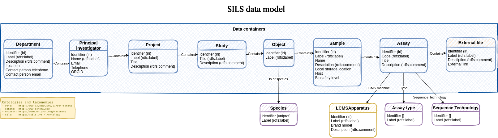
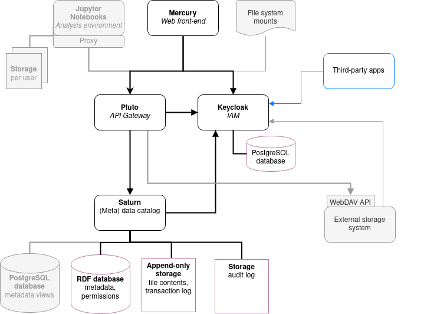

= SILS-Fairspace
The Hyve
VERSION, {docdate}
:description: Fairspace documentation.
:author: The Hyve
:doctype: book
:showtitle!:
:url-repo: https://github.com/thehyve/sils-fairspace
:source-highlighter: rouge
:icons: font
:toc: macro
:toclevels: 3
:toc-title: SILS-Fairspace

:Jena: https://jena.apache.org/
:RDF: https://en.wikipedia.org/wiki/Resource_Description_Framework
:SPARQL: https://www.w3.org/TR/sparql11-query/
:SHACL: https://www.w3.org/TR/shacl/
:Keycloak: https://www.keycloak.org/
:Keycloak_server_administration: https://www.keycloak.org/docs/latest/server_admin/
:JupyterHub: https://jupyterhub.readthedocs.io/
:FAIR: https://www.go-fair.org/fair-principles/
:WebDAV: https://en.wikipedia.org/wiki/WebDAV
:json-ld: https://json-ld.org/
:jsonld-schema: https://raw.githubusercontent.com/json-ld/json-ld.org/master/schemas/jsonld-schema.json
:turtle: https://www.w3.org/TR/turtle/
:n-triples: https://www.w3.org/TR/n-triples/
:fairspace-repository: https://github.com/thehyve/fairspace/

This repository is based on {fairspace-repository}[thehyve/fairspace].

image:docs/images/Fairspace.png[Fairspace]

Fairspace is a secure place for managing research data.
Researchers can add or edit directories representing metadata entities.
Data access is organised per entity type.

The metadata is stored using the {RDF}[Resource Description Framework (RDF)] in
an {Jena}[Apache Jena] database.
For the metadata, a data model can be configured that suits
the data management needs of the organisation.
The data model is specified using the {SHACL}[Shapes Constraint Language (SHACL)],
see the section on <<Data model and view configuration>>.

.*Key features*
****

* Fairspace ensures that all metadata entities have a unique identifier and checks
metadata consistency and validity upon data entry.
* Fairspace allows organisations to *customise* the configured data model,
by specifying custom entity types and constraints.
This enables the adoption of community standards for metadata relevant for the research domain,
which contributes to the *reusability* of the data.
* Fairspace uses the {RDF}[Resource Description Framework (RDF)] and {WebDAV}[WebDAV] standards for data exchange,
and stimulates the use of standard vocabularies,
contributing to *interoperability* of data.
****

toc::[]

== Usage

=== User interface

==== Login

Users are authenticated using {Keycloak}[Keycloak], an open-source identity provider
that provides secure authentication methods and can be configured to integrate
with institutional identity providers using user federation or identity brokering,
see the {Keycloak_server_administration}[Keycloak server administration] pages.

The user either logs in directly using Keycloak or is forwarded to a configured
external login:

image:docs/images/screenshots/Keycloak login.png[Keycloak login]

==== Directories

Data is organised into defined levels.
The data model configuration allows to specify custom entity types, constraints and the hierarchy.

Due to the data loss prevention, data in Fairspace is not removed from the system on deletion.
Deleted collections and files can still be viewed in the application using "Show deleted" switch.
The goal is to prevent deleted data from being overwritten by users (not to create collections or files with the paths
that already existed in the system) and to allow administrators to perform special actions (to be performed only in exceptional special cases),
like undeletion or permanent removal, to revert accidental removal or creation of a directory.

===== Metadata forms

Users with write access to specific entity level can create directories at this level and edit properties of linked entities
 using _metadata forms_.
Free text fields, like description and key words, can be entered freely,
links to other entities or values from a controlled vocabulary, like taxonomy or analysis type,
can be selected from a list:

image:docs/images/screenshots/Metadata form.png[Metadata form]

Entities that are not part of the hierarchy, as well as controlled vocabularies cannot
be added via the user interface.
The <<RDF metadata>> API should be used for that instead.

===== Metadata upload

Another way to update metadata of existing entities that are linked to directories in the directory browser
is uploading a comma-separated values (CSV) file with metadata.
This section describes the CSV-based format used for bulk metadata uploads.

The file should be a valid CSV-file:

* Records are separated with a ``,``-character.
* Values may be enclosed in double quotes: ``"value"``.
* In values that contain a double, the double quotes need to be escaped by replacing them with double double quotes:
``Example "quoted" text`` becomes ``"Example ""quoted"" text"``.

In the metadata upload, lines starting with ``#`` are ignored. These lines are considered to be comments.

The file should have a header row containing the names of the columns.
The mandatory ``DirectoryName`` column is used for the the name of directory in the current path.
For the property columns, the name should match exactly the name of the property in the database.

The format of the values is as follows:

* _DirectoryName_: the name of existing directory in the current folder.
* _Entity types_ can be referenced by ID or unique label. If a label is not unique, the ID needs to be used, otherwise an error will be returned.
* Multiple values must be separated by the pipe symbol ``|``, e.g.,
use ``test|lab`` to enter the values ``test`` and ``lab``.

The file can be uploaded to the current directory by dropping the file in the metadata panel of the directory, or by selecting the metadata upload button. +
By hovering over the metadata upload button, a link to a _metadata template file_ becomes available:

image:docs/images/screenshots/Download metadata template.png[Download metadata template,role="th",align="center"]

The file describes the format in commented lines and
contains the available properties in the header row.

.Example metadata file
====
An example comma-separated values file with metadata about the directories ``Department 1`` and ``Department 2``.
[source, csv]
----
"DirectoryName","Label","Description","Location","Contact person name","Contact person telephone","Contact person email"
"Department 1",,"This is the first department.","Utrecht, The Netherlands","John Smith","+31123456789","john.smith@example.com"
"Department 2",,"This is the second department.","Amsterdam, The Netherlands","Jane Doe",,"jane.doe@example.com"

----
This specifies the table:
[%header,format=csv]
|===
"DirectoryName","Label","Description","Location","Contact person name","Contact person telephone","Contact person email"
"Department 1",,"This is the first department.","Utrecht, The Netherlands","John Smith","+31123456789","john.smith@example.com"
"Department 2",,"This is the second department.","Amsterdam, The Netherlands","Jane Doe",,"jane.doe@example.com"
|===
====

==== Metadata

Explore metadata and find associated directories.
image:docs/images/screenshots/Metadata view.png[Metadata]

=== Interfaces for accessing and querying data (API)

The data in Fairspace can be accessed via Application Programming Interfaces (APIs).
The user interfaces application uses those APIs, but also other programs can use them,
e.g., for automated data uploading or for exporting data for further processing
or for synchronisation with other systems.

==== Authentication

All API endpoints require authentication via an authorisation header.
To enable WebDAV clients to connect to Fairspace, also so-called _Basic authentication_ is supported.

For secure authentication, it is strongly advised to use the _OpenID Connect (OIDC) / OAuth2_ workflow.
The user interface application also uses this workflow.

When using the APIs in automated scripts, ensure that an account is used with only the required
privileges (conform the _principle of least privilege_). I.e., when an admin account is not needed, use a non-admin account.
For adding shared metadata, an account with
_Add shared metadata_ role is required, see <<Uploading metadata>>.

When an action is done on behalf of a specific user,
do not use a service account or system account for the action directly, but obtain a token for that user first, e.g.,
by using the https://www.keycloak.org/docs/latest/securing_apps/#impersonation[impersonation] feature of Keycloak.
That way the audit logging still captures which user did what.

===== OpenID Connect (OIDC) / OAuth2 workflow

Fairspace supports OpenID Connect authentication via Keycloak.
The workflow for API access is roughly as follows.

* The client authenticates with the token endpoint of the identity provider (Keycloak) and obtains a signed access token
* The client uses the access token in the request header when connecting to the Fairspace API
* Fairspace receives the request with the access token and validates if the token is valid,
  using the public key of the identity provider.

The token endpoint of Keycloak supports refreshing the token if it is close to expiry.
However, checking the token expiration and refreshing make the authentication logic quite complex.

You can either obtain a fresh token before every API request or use an existing library
that implements the authentication workflow.
For finding available client-side libraries,
check the https://www.keycloak.org/docs/latest/securing_apps/[Securing applications and services guide] of Keycloak.

For use in scripts, it is advised to obtain a token for offline access, using the https://www.keycloak.org/docs/latest/server_admin/#_offline-access[Offline access] feature of OpenID Connect.

.Code to obtain the OpenID Connect authorisation header (Python)
[%collapsible]
====
[source, python]
----
import logging
import os
import requests

log = logging.getLogger()

def fetch_access_token(keycloak_url: str = os.environ.get('KEYCLOAK_URL'),
                       realm: str = os.environ.get('KEYCLOAK_REALM'),
                       client_id: str = os.environ.get('KEYCLOAK_CLIENT_ID'),
                       client_secret: str = os.environ.get('KEYCLOAK_CLIENT_SECRET'),
                       username: str = os.environ.get('KEYCLOAK_USERNAME'),
                       password: str = os.environ.get('KEYCLOAK_PASSWORD')) -> str:
    """
    Obtain access token from Keycloak
    :return: the access token as string.
    """
    params = {
        'client_id': client_id,
        'client_secret': client_secret,
        'username': username,
        'password': password,
        'grant_type': 'password'
    }
    headers = {
        'Content-type': 'application/x-www-form-urlencoded',
        'Accept': 'application/json'
    }
    response = requests.post(f'{keycloak_url}/auth/realms/{realm}/protocol/openid-connect/token',
                             data=params,
                             headers=headers)
    if not response.ok:
        log.error('Error fetching token!', response.json())
        raise Exception('Error fetching token.')
    data = response.json()
    token = data['access_token']
    log.info(f"Token obtained successfully. It will expire in {data['expires_in']} seconds")
    return token

def auth():
    return f'Bearer {fetch_access_token()}'
----
====

.Code to obtain the OpenID Connect authorisation header (bash, curl)
[%collapsible]
====
Requires the https://stedolan.github.io/jq/[jq] JSON parser.
[source, bash]
----
fetch_access_token() {
  curl -s \
    --data-urlencode "client_id=${KEYCLOAK_CLIENT_ID}" \
    --data-urlencode "client_secret=${KEYCLOAK_CLIENT_SECRET}" \
    --data-urlencode "username=${KEYCLOAK_USERNAME}" \
    --data-urlencode "password=${KEYCLOAK_PASSWORD}" \
    -d 'grant_type=password' \
    "${KEYCLOAK_URL}/auth/realms/${KEYCLOAK_REALM}/protocol/openid-connect/token" | jq -r '.access_token'
}
ACCESS_TOKEN=$(fetch_access_token)
----
====

===== Basic authentication

For WebDAV client access and for a simpler authentication method
during testing, Fairspace also supports _Basic authentication_,
which means that the ``base64`` encoded ``username:password`` string is sent in the ``Authorization`` header together with a prefix ``Basic ``.

This authentication method is considered to be less secure than
token based authentication, because it requires scripts to have
a plain text password stored somewhere.
Also, users may have to retype their passwords when logging in, tempting them to choose less secure, easier to remember, passwords.

.Code to generate the Basic authorisation header (Python)
[%collapsible]
====
[source, python]
----
import base64
import os

def auth():
    username = os.environ.get('KEYCLOAK_USERNAME')
    password = os.environ.get('KEYCLOAK_PASSWORD')
    return f"Basic {base64.b64encode(f'{username}:{password}'.encode()).decode()}"
----
====

.Code to generate the Basic authorisation header (bash)
[%collapsible]
====
[source, bash]
----
AUTH_HEADER="Basic $(echo -n "${KEYCLOAK_USERNAME}:${KEYCLOAK_PASSWORD}" | base64)"
----
====

===== Examples

In the examples in this documentation, we assume one of both methods to be available.

This means for the Python examples that a function ``auth()`` should be implemented that returns the authorisation header value, see the examples above.

[source, python]
----
import os
from requests import Response, Session

def auth():
    """ Returns authorisation header
    Replace this with an implementation from one of the sections above.
    """
    pass

server_url = os.environ.get('FAIRSPACE_URL')
headers = {
    'Authorization': auth()
}
response = Session().get(f'{server_url}/api/users/current', headers=headers)
if not response.ok:
    raise Exception(f"Error fetching current user: {response.status_code} {response.reason}")
print(response.json())
----

For examples using curl, an authorisation header needs to be passed using the ``-H`` option.

For Basic authentication:
[source, bash]
----
AUTH_HEADER="Basic $(echo -n "${KEYCLOAK_USERNAME}:${KEYCLOAK_PASSWORD}" | base64)"
curl -i -H "Authorization: ${AUTH_HEADER}" "${FAIRSPACE_URL}/api/users/current"
----

For OpenID Connect:
[source, bash]
----
# ACCESS_TOKEN=...
AUTH_HEADER="Bearer ${ACCESS_TOKEN}"
curl -i -H "Authorization: ${AUTH_HEADER}" "${FAIRSPACE_URL}/api/users/current"
----

==== WebDAV

A file storage API is exposed via the WebDAV protocol for accessing the file system via the web. It runs on ``/api/webdav/``.

This endpoint can be used by many file explorers,
including Windows Explorer,
and by tools like https://filezilla-project.org/[FileZilla] and https://cyberduck.io/[Cyberduck].
Use ``\https://fairspace.example.com/api/webdav/`` or
``davs://fairspace.example.com/api/webdav/`` as location, with
``fairspace.example.com`` replaced by the server name.

All entities visible in the browser are directories of a specific type. Each directory is linked to a metadata entity that contains set of properties that depend on the type.

The {WebDAV}[Web-based Distributed Authoring and Versioning (WebDAV)] protocol allows users to operate on collections and files.
Fairspace exposes a WebDAV API for accessing the file systems, while restricting access to only the files accessible by the user.

The WebDAV API allows to upload and download files and to perform standard file operations such as copying or moving,
as well as custom operations, such as collection lifecycle management
and advanced data loss prevention features such as versioning and undeletion.

Be aware that the both _copy_ and _move_ operation copies/moves directory and all subdirectories, linked metadata entities however are not copied, but reused.
In case of copy operation both original directory and its new copy will be linked to the same metadata entity. The same applies to all the child directories
of the original directory.

===== Directory listing and path properties

|===
2+| ``PROPFIND /api/webdav/{path}``

2+| _Request headers_:
| `Depth`
| When ``0`` only the information about the path is returned,
  when ``1`` the contents of the directory is returned, if the path is a directory.
| `Show-Deleted`
| Include deleted paths when the value is `on`. (_Optional_)
| `Version`
| Specify a version number to request properties of a specific file version.
  The first version has number `1`. If not specific, the current version is returned.
| `With-Metadata-Links`
| Include list of metadata entities that are linked to the resource, when value `true`.
2+| _Request body_:
2+| To include also custom Fairspace attributes in the response, like the collection description, send the following request body: +
  ``<propfind><allprop /></propfind>``
|===

====== Code examples

.Check if path exists (Python)
[%collapsible]
====
[source, python]
----
import logging
import os
import requests

log = logging.getLogger()

server_url = os.environ.get('FAIRSPACE_URL')

def exists(path):
    """ Check if a path exists
    """
    headers = {
        'Depth': '0',
        'Authorization': auth()
    }
    response = requests.request('PROPFIND', f'{server_url}/api/webdav/{path}/', headers=headers)
    return response.ok
----
====

.Fetch directory listing (Python)
[%collapsible]
====
[source, python]
----
import logging
import os
import requests
from xml.etree.ElementTree import fromstring

log = logging.getLogger()

server_url = os.environ.get('FAIRSPACE_URL')

def ls(path: str):
    """ List contents of path
    """
    headers = {
        'Depth': '1',
        'Authorization': auth()
    }
    data = "<propfind><allprop /></propfind>"
    response = requests.request('PROPFIND', f'{server_url}/api/webdav/{path}/', data=data, headers=headers)
    if not response.ok:
        raise Exception(f"Error fetching directory '{path}': {response.status_code} {response.reason}")
    tree = fromstring(response.content.decode())
    for item in tree.findall('{DAV:}response'):
        print(item.find('{DAV:}href').text)
----
====

.Fetch directory listing (curl)
[%collapsible]
====
Requires the http://xmlstar.sourceforge.net/[xmlstarlet] tool.
[source, bash]
----
curl -s -H "Authorization: ${AUTH_HEADER}" -X PROPFIND -H "Depth: 1" "${FAIRSPACE_URL}/api/webdav/${path}" -d '<propfind><allprop /></propfind>' \
| xmlstarlet sel -T -t -m d:multistatus/d:response -v d:propstat/d:prop/d:displayname -n
----
====

===== Create directory of specific type

|===
2+| ``MKCOL /api/webdav/{path}``

2+| Create a new Department-type directory
2+| _Request headers_:
| `Entity-Type`
| Specify the URI of directory type, e.g. 'https://fairspace.nl/ontology#Department'
|===

.Example create directory (Python)
[%collapsible]
====
[source, python]
----
import logging
import os
import requests

log = logging.getLogger()

server_url = os.environ.get('FAIRSPACE_URL')

def mkdir(path: str, entity_type: str):
    # Create directory
    headers = {
        'Authorization': auth(),
        'Entity-Type': entity_type,
    }
    response = requests.request('MKCOL', f'{server_url}/api/webdav/{path}/', headers=headers)
    if not response.ok:
        log.error('Error uploading data!')
        log.error(f'{response.status_code} {response.reason} {response.content.decode()}')
        raise Exception(f"Error creating directory '{path}': {response.status_code} {response.reason}")
----
====

.Example create directory (curl)
[%collapsible]
====
[source, bash]
----
# Create a new Department-type directory
NEW_DIR=New department
ENTITY_TYPE=https://fairspace.nl/ontology#Department
curl -i -H "Authorization: ${AUTH_HEADER}" -X MKCOL -H "Entity-Type: ${ENTITY_TYPE}" "${FAIRSPACE_URL}/api/webdav/${NEW_DIR}"
----
====

===== Create directory reusing existing metadata entity

|===
2+| ``MKCOL /api/webdav/{path}``

2+| Create a new directory linked to existing department metadata entity
2+| _Request headers_:
| `Linked-Entity-IRI`
| Specify the IRI of existing entity to be linked to the new directory, e.g. 'http://localhost/iri/ac122623-22f6-4311-83ea-97c024b9bbc2'
|===

.Example create directory using existing entity (Python)
[%collapsible]
====
[source, python]
----
import logging
import os
import requests

log = logging.getLogger()

server_url = os.environ.get('FAIRSPACE_URL')

def mkdir(path: str, entity_iri: str):
    # Create directory
    headers = {
        'Authorization': auth(),
        'Linked-Entity-IRI': entity_iri,
    }
    response = requests.request('MKCOL', f'{server_url}/api/webdav/{path}/', headers=headers)
    if not response.ok:
        log.error('Error uploading data!')
        log.error(f'{response.status_code} {response.reason} {response.content.decode()}')
        raise Exception(f"Error creating directory '{path}': {response.status_code} {response.reason}")
----
====

.Example create directory using existing entity (curl)
[%collapsible]
====
[source, bash]
----
# Create a new Department-type directory
NEW_DIR=New department
ENTITY_IRI=http://localhost/iri/ac122623-22f6-4311-83ea-97c024b9bbc2
curl -i -H "Authorization: ${AUTH_HEADER}" -X MKCOL -H "Entity-Type: ${ENTITY_IRI}" "${FAIRSPACE_URL}/api/webdav/${NEW_DIR}"
----
====

===== Copy and move a directory

|===
2+| ``COPY /api/webdav/{path}``

2+| Copy a directory. New directory will be linked to the same metadata entity as original directory.
2+| _Request headers_:
| ``Destination``
| The destination path relative to the server, URL encoded, e.g., ``/api/webdav/Department%201/PI%201``.
| The destination directory has to have the same type as the source.
|===

.Example copy path (Python)
[%collapsible]
====
[source, python]
----
import logging
import os
import requests
from urllib.parse import quote

log = logging.getLogger()

server_url = os.environ.get('FAIRSPACE_URL')

def copy():
    path = 'Department 1/PI 1/Project 1/Study 1'
    target = quote('Department 1/PI 1/Project 2/Study 1', safe='/')
    headers = {
        'Authorization': auth(),
        'Destination': f"/api/webdav/{target}"
    }
    response = requests.request('COPY', f'{server_url}/api/webdav/{path}/', headers=headers)
    if not response.ok:
        log.error('Error uploading data!')
        log.error(f'{response.status_code} {response.reason} {response.content.decode()}')
        raise Exception(f"Error copying directory '{path}': {response.status_code} {response.reason}")
----
====

.Example copy path (curl)
[%collapsible]
====
[source, bash]
----
# Copy 'Department 1/PI 1/Project 1/Study 1' to 'Department 1/PI 1/Project 2/Study 1''
path="Department 1/PI 1/Project 1/Study 1"
target="/api/webdav/Department%201/PI%201/Project%202/Study%201"
curl -i -H "Authorization: ${AUTH_HEADER}" -X COPY -H "Destination: ${target}" "${FAIRSPACE_URL}/api/webdav/${path}"
----
====

|===
2+| ``MOVE /api/webdav/{path}``

2+| Move or rename a directory. Metadata linked to the directory is also moved along with it.
2+| _Request headers_:
| ``Destination``
| The destination path relative to the server, URL encoded, e.g., ``/api/webdav/Department%201/PI%201``.
| The destination directory has to have the same type as the source.
|===

.Example move path (Python)
[%collapsible]
====
[source, python]
----
import logging
import os
import requests
from urllib.parse import quote

log = logging.getLogger()

server_url = os.environ.get('FAIRSPACE_URL')

def copy():
    path = 'Department 1/PI 1/Project 1/Study 1'
    target = quote('Department 1/PI 1/Project 2/Study 1', safe='/')
    headers = {
        'Authorization': auth(),
        'Destination': f"/api/webdav/{target}"
    }
    response = requests.request('MOVE', f'{server_url}/api/webdav/{path}/', headers=headers)
    if not response.ok:
        log.error('Error uploading data!')
        log.error(f'{response.status_code} {response.reason} {response.content.decode()}')
        raise Exception(f"Error moving directory '{path}': {response.status_code} {response.reason}")
----
====

.Example move path (curl)
[%collapsible]
====
[source, bash]
----
# Copy 'Department 1/PI 1/Project 1/Study 1' to 'Department 1/PI 1/Project 2/Study 1''
path="Department 1/PI 1/Project 1/Study 1"
target="/api/webdav/Department%201/PI%201/Project%202/Study%201"
curl -i -H "Authorization: ${AUTH_HEADER}" -X MOVE -H "Destination: ${target}" "${FAIRSPACE_URL}/api/webdav/${path}"
----
====

===== Undelete a directory

|===
2+| ``POST /api/webdav/{path}`` +
    ``action=undelete``

2+| Undelete a directory or file
2+| _Request headers_:
| ``Show-deleted``
| ``on``
2+| _Request data_:
| ``action``
| ``undelete``
|===

.Example undelete path (curl)
[%collapsible]
====
[source, bash]
----
curl -i -H "Authorization: ${AUTH_HEADER}" -X POST -F "action=undelete" "${FAIRSPACE_URL}/api/webdav/${path}"
----
====

==== SPARQL
The {SPARQL}[SPARQL] API is a standard API for querying RDF databases.
This endpoint is *read-only* and can be used for advanced search, analytics, data extraction, etc.

|===
| ``POST /api/rdf/query``

| Execute SPARQL query
| _Request body:_
| The SPARQL query.
|===

.Example SPARQL query (Python)
[%collapsible]
====
Query for the first 500 samples.
[source, python]
----
import logging
import os
from requests import Response, Session

log = logging.getLogger()

server_url = os.environ.get('FAIRSPACE_URL')

def query_sparql(query: str):
    headers = {
        'Authorization': auth(),
        'Content-Type': 'application/sparql-query',
        'Accept': 'application/json'
    }
    response: Response = Session().post(f"{server_url}/api/rdf/query", data=query, headers=headers)
    if not response.ok:
        raise Exception(f'Error querying metadata: {response.status_code} {response.reason}')
    return response.json()

query_sparql("""
    PREFIX example: <https://example.com/ontology#>
    PREFIX fs: <https://fairspace.nl/ontology#>

    SELECT DISTINCT ?sample
    WHERE {
        ?sample a example:BiologicalSample .
        FILTER NOT EXISTS { ?sample fs:dateDeleted ?anyDateDeleted }
    }
    # ORDER BY ?sample
    LIMIT 500
""")
----
====

.Example SPARQL query (curl)
[%collapsible]
====
Query for the first 500 samples.
[source, bash]
----
curl -X POST -H "Authorization: ${AUTH_HEADER}" -H 'Content-Type: application/sparql-query' -H 'Accept: application/json' \
-d "
    PREFIX example: <https://example.com/ontology#>
    PREFIX fs: <https://fairspace.nl/ontology#>

    SELECT DISTINCT ?sample
    WHERE {
        ?sample a example:BiologicalSample .
        FILTER NOT EXISTS { ?sample fs:dateDeleted ?anyDateDeleted }
    }
    # ORDER BY ?sample
    LIMIT 500
" \
"${FAIRSPACE_URL}/api/rdf/query"
----
====

==== RDF metadata

For reading and writing metadata to the database,
the ``/api/metadata`` endpoint supports a number of operations:

* ``GET``: Retrieve metadata for a specified subject, predicate or object.
* ``PUT``: Add metadata
* ``PATCH``: Update metadata
* ``DELETE``: Delete specified triples or all metadata linked to a subject.

The metadata is stored as subject-predicate-object triples.
The API supports several serialisation formats for sending :

* {turtle}[Turtle] (``text/turtle``)
* {json-ld}[JSON-LD] (``application/ld+json``, {jsonld-schema}[JSON schema])
* {n-triples}[N-Triples] (``application/n-triples``)

After any update, the metadata must be consistent with the data model, see <<Data model and view configuration>>.
If an update would violate the data model constraints,
the request is rejected with a status ``400`` response, with a message indicating the violation.

===== Uploading metadata

Shared metadata entities will in most cases come from other systems and will be added to Fairspace exclusively by an ETL process which will extract data from the laboratory and clinical systems, perform pseudonymization of identifiers, convert the metadata to some RDF-native format conforming the data model and send them to Fairspace.

Fairspace will validate the uploaded metadata against the constraints defined in the data model and returns a detailed error message in case of violations.
The validations include all the necessary type checks, referential consistency (validity of identifiers) checks, validation of mandatory fields, etc.
If any entity violates the constraints, the entire bulk upload will be rejected.

Users with admin role can add or modify directories and linked entities on all levels of the hierarchy.
Regular users can add or modify directories and linked metadata entities of types definitions of which do not have `fs:adminEditOnly true` property in the data model.

API users can use the RDF-based metadata API to add or modify metadata properties.

A number of guidelines for uploading metadata:

* Entities must have a type, a globally unique identifier,
  and a unique label for the type. +
It is advised to use a unique identifier from an existing reference system for this purpose.
* Because of the nature of linked data, it is advised
  to add metatdata entities in an append-only fashion: only adding entities and avoid updating or deleting entities.
* By nature of RDF, metadata is typically added on the level of triples.
E.g., when adding a property ``dcat:keyword`` to a file, this will add a key word to the (possibly) already existing list of key words. +
If you want to completely replace (or remove)
a property from an entity, use the ``PATCH`` method instead of ``PUT``.

Example controlled vocabulary file in turtle format: ``controlled_vocabulary.ttl``:
[source, turtle]
----
@prefix test: <https://test.com/ontology#> .
@prefix example: <https://example.com/ontology#> .
@prefix rdfs: <http://www.w3.org/2000/01/rdf-schema#> .
@prefix uniprot: <https://www.uniprot.org/taxonomy/> .

uniprot:9598 a custom_ontology:Species ;
    rdfs:label "Pan troglodytes" .

uniprot:9606 a custom_ontology:Species ;
    rdfs:label "Homo sapiens" .

example:DNASeqAssayType a test:AssayType ;
    rdfs:label "DNA seq assay" .

example:RNAAssayType a test:AssayType ;
    rdfs:label "RNA assay" .
----

Example metadata file in turtle format: ``testdata.ttl``:
[source, turtle]
----
@prefix test: <https://test.com/ontology#> .
@prefix rdfs: <http://www.w3.org/2000/01/rdf-schema#> .
@prefix subject: <http://example.com/subjects#> .
@prefix gender: <http://hl7.org/fhir/administrative-gender#> .
@prefix ncbitaxon: <https://bioportal.bioontology.org/ontologies/NCBITAXON/> .

subject:s1 a test:Subject ;
    rdfs:label "Subject 1" ;
    example:isOfSpecies ncbitaxon:9606 .
    example:isOfGender gender:male ;
----

.Example uploading metadata file using Python.
[%collapsible]
====
[source, python]
----
import logging
import os
from requests import Response, Session

log = logging.getLogger()

server_url = os.environ.get('FAIRSPACE_URL')

with open('testdata.ttl') as testdata:
    headers={'Content-type': 'text/turtle',
             'Authorization': auth()}
    with open('testdata.ttl') as testdata:
        response = requests.put(f"{server_url}/api/metadata/", data=testdata.read(), headers=headers)

    if not response.ok:
        log.error('Error uploading data!')
        log.error(f'{response.status_code} {response.reason} {response.json()}')
        raise Exception('Error uploading data.')
----
====

.Example uploading metadata file (curl).
[%collapsible]
====
[source, bash]
----
curl -v -X PUT -H "Authorization: Basic $(echo -n "${KEYCLOAK_USERNAME}:${KEYCLOAK_PASSWORD}" | base64)" \
  -H "Content-type: text/turtle" --data @testdata.ttl "${FAIRSPACE_URL}/api/metadata/"
----
====

===== API specification

|===
3+| ``GET /api/metadata/``

3+| Retrieve metadata
3+| _Parameters:_
| ``subject``
| string
| IRI of the subject to filter on.
| ``predicate``
| string
| The predicate to filter on, not required.
| ``object``
| string
| The object to filter on, not required.
| ``includeObjectProperties``
| boolean
| If set, the response will include several properties for the included objects.
  The properties to be included are marked with ``fs:importantProperty`` in the vocabulary.
3+| _Response:_
3+| Returns serialised triples matching the query parameters.
|===

.Example of fetching metadata in turtle format (curl)
[%collapsible]
====
Request metadata for a subject 'a'.
[source, bash]
----
curl -G -H "Accept: text/turtle" \
--data-urlencode "subject=a" \
--data-urlencode "withValueProperties=true" \
"http://localhost:8080/api/metadata/"
----
====

.Example of fetching metadata in json-ld format (curl)
[%collapsible]
====
Request metadata for the triple with subject 'a', predicate 'b' and object 'c'.
[source, bash]
----
curl -G -H "Accept: application/ld+json" \
--data-urlencode "subject=a" \
--data-urlencode "predicate=b" \
--data-urlencode "object=c" \
--data-urlencode "withValueProperties=true" \
"http://localhost:8080/api/metadata/"
----
====

|===
3+| ``PUT /api/metadata/``

3+| Add metadata. Existing metadata is left untouched.
    The data must be consistent with the data model after the update (see <<Data model and view configuration>>),
    otherwise ``400`` is returned.

3+| _Request body:_
3+| Serialised RDF triples.
|===

.Example of adding metadata in turtle format (curl)
[%collapsible]
====
[source, bash]
----
curl -X PUT -H "Content-type: text/turtle" -d \
'
@prefix example: <https://example.com/ontology#> .
@prefix rdfs: <http://www.w3.org/2000/01/rdf-schema#> .
@prefix test: <https://test.com/ontology#> .
example:Study_001 a test:Study ;
    rdfs:label "Project study #001" ;
    test:studyIdentifier "STUDY-001" ;
    test:studyTitle "Project study #001" ;
    test:studyDescription "This is a description of the study." .
' \
"http://localhost:8080/api/metadata/"
----
====

|===
3+| ``PATCH /api/metadata/``

3+| Update metadata.
    Any existing metadata for a given subject/predicate combination will be overwritten with the provided values.
    The data must be consistent with the data model after the update (see <<Data model and view configuration>>),
    otherwise ``400`` is returned.

3+| _Request body:_
3+| Serialised RDF triples.
|===

.Example of updating metadata in turtle format (curl)
[%collapsible]
====
[source, bash]
----
curl -X PATCH -H "Content-type: text/turtle" -d \
'
@prefix example: <https://example.com/ontology#> .
@prefix test: <https://test.com/ontology#> .
example:Study_001 a test:Study ;
    test:studyTitle "Updated project study #001" ;
' \
"http://localhost:8080/api/metadata/"
----
====

|===
3+| ``DELETE /api/metadata/``

3+| Delete metadata.
If a request body is provided, the triples specified in the body will be deleted.
Otherwise, the subject specified in the subject parameter will be marked as deleted.
Please note that the subject will still exist in the database.

3+| _Parameters:_
| ``subject``
| string
| The subject to filter on. (_Optional_)
3+| _Request body:_
3+| Serialised RDF triples. (_Optional_)
|===

.Example of deleting triples in turtle format (curl)
[%collapsible]
====
[source, bash]
----
curl -X DELETE -H "Content-Type: text/turtle" -d \
'
@prefix example: <https://example.com/ontology#> .
@prefix test: <https://test.com/ontology#> .
example:Study_001 a test:Study ;
    test:studyDescription "This is a description of the study." .
' \
"http://localhost:8080/api/metadata/"
----
====

.Example of marking an entity as deleted (curl)
[%collapsible]
====
[source, bash]
----
curl -X DELETE -G --data-urlencode "subject=https://example.com/ontology#tpe1" "http://localhost:8080/api/metadata/"
----
====

==== Metadata views

Metadata views endpoint used for metadata-based search.

|===
| ``GET /api/views/``

| List all views with available columns per each view.
|===

.Example list view (curl)
[%collapsible]
====
[source, bash]
----
curl -H "Accept: application/json" "http://localhost:8080/api/views/"
----
====

|===
3+| ``POST /api/views/``

3+| Fetch page of rows of a view matching the request filters.
3+| _Parameters:_
| ``view``
| string
| Name of the view.
| ``filters``
2+| List of filters, based on available facets and their values.
Each filter has to contain a "field" property, matching the name of a facet, and list of values to filter on.
| ``page``
| integer
| Requested page
| ``size``
| integer
| Page size
|===

.Example fetching page of view rows (curl)
[%collapsible]
====
[source, bash]
----
curl -X POST -H 'Content-type: application/json' -H 'Accept: application/json' -d \
'{
  "view":"Resource",
  "filters":[
    {
      "field":"Resource",
      "prefix":"Immuno"
    }
  ],
  "page":1,
  "size":10
}' \
"http://localhost:8080/api/views/"
----
====

|===
3+| ``POST /api/views/count``

3+| Count rows of a view matching request filters.
3+| _Parameters:_
| ``view``
| string
| Name of the view.
| ``filters``
2+| List of filters, based on available facets and their values.
Each filter has to contain a "field" property, matching the name of a facet, and list of values to filter on.
|===

.Example counting view rows (curl)
[%collapsible]
====
[source, bash]
----
curl -X POST -H 'Content-type: application/json' -H 'Accept: application/json' -d \
'{
  "view":"Resource",
  "filters":[
    {
      "field":"Resource",
      "prefix":"Immuno"
    }
  ]
}' \
'http://localhost:8080/api/views/count'
----
====

|===
| ``GET /api/views/facets``

| List all facets with available values per each facet.
|===

.Example retrieving facets with values (curl)
[%collapsible]
====
[source, bash]
----
curl -H "Accept: application/json" "http://localhost:8080/api/views/facets"
----
====

==== Text search

Search endpoint used for text search on labels or comments.

|===
3+| ``POST /api/search/files``

3+| Find files, directories or collections based on a label or a comment.
3+| _Parameters:_
| ``query``
| string
| Text fragment to search on.
| ``parentIRI``
| string
| IRI of the parent directory or collection to limit the search area.

3+| _Response_
3+| Object in JSON format, with `query` and `results` properties.
Results contain a list of files (and/or directories, collections) with the following properties:
| ``id``
| string
| Directory identifier (IRI).
| ``label``
| string
| Directory name.
| ``type``
| string
| Type of the resource as defined in the vocabulary, e.g. "https://fairspace.nl/ontology#Directory"
| ``comment``
| string
| File (or directory) description. Optional.
|===

.Example text search (curl)
[%collapsible]
====
[source, bash]
----
curl -X POST -H 'Content-type: application/json' -H 'Accept: application/json' -d \
'{
  "query":"test folder",
  "parentIRI":"http://localhost:8080/api/webdav/dir1"
}' \
'http://localhost:8080/api/search/files'
----
====

.Example text search response
[%collapsible]
====
[source, json]
----
{
  "results": [
    {
      "id": "https://fairspace.example.com/api/webdav/dep1/pi1",
      "label": "pi1",
      "type": "https://fairspace.nl/ontology#Directory",
      "comment": null
    },
    {
      "id": "https://fairspace.example.com/api/webdav/dep2/pi1/pi_study1",
      "label": "pi_study1",
      "type": "https://fairspace.nl/ontology#Directory",
      "comment": null
    }
  ],
  "query": "pi"
}
----
====

|===
3+| ``POST /api/search/lookup``

3+| Metadata entities lookup search by entity labels or description.
3+| _Parameters:_
| ``query``
| string
| Text fragment to search on.
| ``resourceType``
| string
| Type of the entity in request.
|===

.Example lookup search (curl)
[%collapsible]
====
[source, bash]
----
curl -X POST -H 'Content-type: application/json' -H 'Accept: application/json' -d \
'{
  "query":"test",
  "resourceType":"https://example.com/ontology#Species"
}' \
'http://localhost:8080/api/search/lookup'
----
====

==== Users and permissions

|===
| ``GET /api/users/``

| List all organisation users.
| _Response:_
| Returns list of users with user's unique ID, name, email, username and user's organisation-level permissions:
if a user is an administrator or super-administrator.
|===

.Example listing users (curl)
[%collapsible]
====
[source, bash]
----
curl -H 'Accept: application/json' 'http://localhost:8080/api/users/'
----
====

|===
3+| ``PATCH /api/users/``

3+| Update user roles.
3+| _Parameters:_
| ``id``
| string
| UUID of the user for which roles will be updated.
| "role name"
| boolean
| Role name is ``isAdmin`` if a user has an admin role.
|===

.Example updating user roles (curl)
[%collapsible]
====
[source, bash]
----
curl -X PATCH -H "Accept: application/json" -H "Content-Type: application/json" -d \
'{
  "id": "123e4567-e89b-12d3-a456-426614174000",
  "isAdmin": true
  }' \
"http://localhost:8080/api/users/"
----
====

|===
| ``GET /api/users/current``

| Get current user.
| _Response:_
| Returns current user's unique ID, name, email, username and user's organisation-level permissions:
if the user is an administrator or super-administrator.
|===

.Example getting current user (curl)
[%collapsible]
====
[source, bash]
----
curl -H "Accept: application/json" "http://localhost:8080/api/users/current"
----
====

|===
| ``POST /api/users/current/logout``

| logout the current user.
|===

.Example logging out (curl)
[%collapsible]
====
[source, bash]
----
curl -X POST "http://localhost:8080/api/users/current/logout"
----
====

==== Configuration endpoints

===== Vocabulary

The vocabulary contains a description of the structure of the metadata.
It contains the types of entities that can be created, along with the data types for the fields.
It is stored in {SHACL}[SHACL] format.

|===
| ``GET /api/vocabulary/``

| Retrieve a representation of the vocabulary.
|===

.Example fetching the vocabulary in turtle format (curl)
[%collapsible]
====
[source, bash]
----
curl -H 'Accept: text/turtle' 'http://localhost:8080/api/vocabulary/'
----
====

.Example fetching the vocabulary in json-ld format (curl)
[%collapsible]
====
[source, bash]
----
curl -H 'Accept: application/json+ld' 'http://localhost:8080/api/vocabulary/'
----
====

===== Features

|===
| ``GET /api/features/``

| List available application features.
|===

Response contains list of additional features that are currently available in the application.

.Example listing features (curl)
[%collapsible]
====
[source, bash]
----
curl -H 'Accept: application/json' 'http://localhost:8080/api/features/'
----
====

===== Services

|===
| ``GET /api/services/``

| List linked services.
|===

Response contains list of external services linked to Fairspace,
e.g. JupyterHub, cBioPortal, etc.

.Example listing services (curl)
[%collapsible]
====
[source, bash]
----
curl -H 'Accept: application/json' 'http://localhost:8080/api/services/'
----
====

===== Server configuration

|===
| ``GET /api/config``

| View server configuration properties.
|===

Response contains a list of server configuration properties,
currently limited to a max file size for uploads.

.Example listing properties (curl)
[%collapsible]
====
[source, bash]
----
curl -H 'Accept: application/json' 'http://localhost:8080/api/config/'
----
====

===== External storages

|===
| ``GET /api/storages/``

| List linked data storages.
|===

Response contains list of external data storages linked to Fairspace.

.Example listing external storages using curl
[%collapsible]
====
[source, bash]
----
curl -H 'Accept: application/json' 'http://localhost:8080/api/storages/'
----
====

=== External file system integration

As Fairspace supports the <<WebDAV>> protocol, it can be configured to connect to external data storages that implement a WebDAV interface.
An overview of external files is integrated into Fairspace user interface. Currently, a read-only interaction is supported.
Users can browse through the external file system, read the data and metadata (e.g. creation date, description).
Files from the external storage will be also made available for analysis in Jupyter Hub.

==== Access policy

Access policies differ between systems. To avoid inconsistencies, permissions validation and management are expected to be under
control of the external storage system. Each storage component is responsible for its own policy and needs to perform
the required checks to ensure that users only get to see the data they are supposed to see.

It is assumed that a user requesting files from a storage using WebDAV has at least "read" access to all the files included in the WebDAV response.
Access can be further limited by using a custom `access` property. If a value of this property on a resource is set to "List",
the resource's metadata will be readable, but it will not be possible to read the resource's content.

Another assumption is that the Fairspace client can authenticate in the external storage via the same Keycloak and the same realm
as configured for Fairspace, so that the same bearer token can be used for all storages.
See the <<Authentication>> section for more information.

==== API specification and supported parameters

A subset of default WebDAV properties is used and displayed as a resource metadata in the Fairspace user interface.
These properties are presented in the table below.

|===
| WebDAV property | Description

| ``DAV:creationdate``
| Creation date
| ``DAV:iscollection``
| Flag determining whether a resource is a file or directory
| ``DAV:getlastmodified``
| Last modification date
| ``DAV:getcontentlength``
| Size of the file (0 for directories)
|===

There is also a set of custom Fairspace properties, some of which are required to be returned from the WebDAV request.

|===
| WebDAV property | Description

| ``iri``
| IRI of the resource. Required.
| ``createdBy``
| Id of a user that created the resource.
| ``comment``
| Resource description.
| ``access``
| By default, users are granted ``Read`` access to the resource returned from WebDAV endpoint.
Other supported value is ``List``, which means that users can see the resource and its metadata, but cannot read its content.
| ``metadataEntities``
| List of IRIs in a form of comma-separated string. IRIs represent all metadata entities linked to the resource.
If the IRI matches a metadata entity stored in Fairspace, such an entity will be displayed in the user interface.
|===

It is also supported to specify any other custom property in the WebDAV response body, as WebDAV responses are easily extendable.
All these properties (if not specifically marked as excluded in Fairspace), will be displayed in the user interface
in a form of key-value pairs.

==== Text search in external storages

Text based search on external file system can be enabled in the Fairpsace user interface,
if the external system exposes a search endpoint, following the specification from the <<Text search>> section.
To enable finding files based on name or description, ``searchUrl`` has to be specified in the storage configuration.

==== Configuration

Multiple external storages can be configured simultaneously. A list of configuration parameters is presented below.

|===
| Parameter | Description

| ``name``
| Unique name of the storage.
| ``label``
| String to be used as a display name of the storage.
| ``url``
| WebDAV endpoint to connect to.
| ``searchUrl``
| Optional search endpoint URL. If specified, a text based search on file name or description will be enabled in the user interface.
| ``rootDirectoryIri``
| Optional IRI of the root directory. If not specified, ``url`` will be used as a default root directory.
|===

Sample configuration of storages in YAML format:
[source, bash]
----
storages:
  exStorage1:
    name: exStorage1
    label: "External storage 1"
    url: https://exstorage1/api/webdav
    searchUrl: https://exstorage1/api/search/
    rootDirectoryIri: http://ex1/api/webdav/
  exStorage2:
    name: exStorage2
    label: "External storage 2"
    url: https://exstorage2/api/webdav
----

== Data model and view configuration

=== Data model

To enable validation of (meta)data, and to enable intuitive navigation and search within the metadata, it is essential to have a good data model. +
The data model consists of the entity types (classes), their properties (with types) and relationships between entities that can be represented in the system.

The data model needs to be broad (expressive) enough to allow users to express all relevant facts about data sets conveniently and accurately, but it needs to be specific enough to allow validation and the generation of useful overviews and information pages.
International data standards should be used as much as possible to enable interoperability between systems.

E.g., it is probably better to use a specific field ‘disease’ where the value must be a valid ICD-10 code, than using a generic ‘description’ field where a disease is described in a free text field.

==== Data domains

We distinguish different data domains in order to clearly separate the data that is system specific and the metadata that is more flexible.

===== System-level metadata

The data model includes system-level properties and entities, like users or directories. These entities are defined in system-vocabulary and cannot be changed,
because they are inherent to the system.

===== Metadata

The data model for the other (non system-level) entities, the shared metadata, can be configured,
in order to make the metadata suitable for the environment where it is used.
These metadata are used to link entities in the file system to entities in the research domain,
such as samples, patients, diseases, diagnoses,
or to entities in the organisation domain, such as projects.
These entities may be displayed and navigated in the application and can be explored through the API (for technical users).

====== Hierarchy configuration

Hierarchy defines directory types and relations between them. Metadata entities that are part of the hierarchy should have
the following properties as part of the entity class definition:

|===
| Property | Description

| ``fs:partOfHierarchy: true``
| Flag determining that the entity is part of the hierarchy.
| ``fs:hierarchyDescendants``
| List of entity types that are valid children of the current entity
| ``fs:hierarchyRoot``
| Flag determining that the current entity is a hierarchy root.
|===

.Example definition of metadata class that is part of the hierarchy.
====

In this example, the Department class is a root entity with `test:PrincipalInvestigator` class as allowed child.

[source, turtle]
----
@prefix owl: <http://www.w3.org/2002/07/owl#> .
@prefix rdf: <http://www.w3.org/1999/02/22-rdf-syntax-ns#> .
@prefix rdfs: <http://www.w3.org/2000/01/rdf-schema#> .
@prefix sh: <http://www.w3.org/ns/shacl#> .
@prefix xsd: <http://www.w3.org/2001/XMLSchema#> .
@prefix dash: <http://datashapes.org/dash#> .
@prefix fs: <https://fairspace.nl/ontology#> .
@prefix test: <https://test.com/ontology#> .

test:Department a rdfs:Class, sh:NodeShape ;
    sh:closed false ;
    sh:description "A division of a large organization such as a government, university, or business, dealing with a specific area of activity." ;
    sh:name "Department" ;
    fs:namePlural "Departments" ;
    sh:ignoredProperties ( rdf:type owl:sameAs  ) ;
    fs:partOfHierarchy true ;
    fs:hierarchyDescendants ( test:PrincipalInvestigator ) ;
    fs:hierarchyRoot true ;
    fs:adminEditOnly true ;
    sh:property
    [
        sh:name "Label" ;
        sh:description "Unique department label." ;
        sh:datatype xsd:string ;
        sh:maxCount 1 ;
        dash:singleLine true ;
        fs:importantProperty true ;
        sh:path rdfs:label ;
        sh:order 0
    ],
    [
        sh:name "Description" ;
        sh:description "The description of the department." ;
        sh:datatype xsd:string ;
        sh:maxCount 1 ;
        sh:path rdfs:comment ;
        sh:order 1
    ] .

----
====

====== Controlled vocabularies

The data model may contain controlled vocabularies (e.g., disease codes, file types, project phases) that can be used as values in the metadata.
Every value in a controlled vocabulary has a unique identifier and a label.
Using such vocabularies enables standardisation and validation of metadata values.

====== Reference data

The data model may support domain specific entity types (patients, samples, genes, treatments, studies, etc.)
or generic entity types (project, organisation, person, etc), defining the metadata objects that collection-level data assets can refer to.
The reference data can also be linked.

Every entity has a unique identifier, a type, a label, and the properties and relations as specified by the type.
These entities do not belong to a particular space that is owned by a specific group or user.

=== Data model configuration

Fairspace uses an {Jena}[Apache Jena] database to store system metadata
and the custom domain specific metadata.
The data models for these metadata are defined using the {SHACL}[Shapes Constraint Language (SHACL)].

* The system system data model is defined in  link:projects/saturn/src/main/resources/system-vocabulary.ttl[system-vocabulary.ttl]
* The customisable data model includes the custom
  metadata entities, custom controlled vocabulary types,
  and custom properties of the system entities.
  The default custom data model is defined in link:projects/saturn/vocabulary.ttl[vocabulary.ttl].
  This data model can be overriden by a data more suitable for your organisation.

A schematic overview of the default data model in link:projects/saturn/vocabulary.ttl[vocabulary.ttl]:

The data model defines an entity-relationship model, specifying
the entity types that are relevant to describe your data assets,
the properties of the entities, and the relationships between entities.

.Example data model
====

In this example data model, the following custom entity types are defined:

 * ``example:Gender`` with property _Label_;
 * ``example:Species`` with property _Label_;
 * ``example:Subject`` with properties _Gender_, _Species_, _Age at last news_ and _Files_.

The system class ``fs:File`` is extended with the _Is about subject_ property.

[source, turtle]
----
@prefix owl: <http://www.w3.org/2002/07/owl#> .
@prefix rdf: <http://www.w3.org/1999/02/22-rdf-syntax-ns#> .
@prefix rdfs: <http://www.w3.org/2000/01/rdf-schema#> .
@prefix sh: <http://www.w3.org/ns/shacl#> .
@prefix xsd: <http://www.w3.org/2001/XMLSchema#> .
@prefix dash: <http://datashapes.org/dash#> .
@prefix fs: <https://fairspace.nl/ontology#> .
@prefix example: <https://example.com/ontology#> .

example:Gender a rdfs:Class, sh:NodeShape ;
    sh:closed false ;
    sh:description "The gender of the subject." ;
    sh:name "Gender" ;
    sh:ignoredProperties ( rdf:type owl:sameAs ) ;
    sh:property
    [
        sh:name "Label" ;
        sh:description "Unique gender label." ;
        sh:datatype xsd:string ;
        sh:maxCount 1 ;
        dash:singleLine true ;
        fs:importantProperty true ;
        sh:path rdfs:label
    ] .

example:Species a rdfs:Class, sh:NodeShape ;
    sh:closed false ;
    sh:description "The species of the subject." ;
    sh:name "Species" ;
    sh:ignoredProperties ( rdf:type owl:sameAs ) ;
    sh:property
    [
        sh:name "Label" ;
        sh:description "Unique species label." ;
        sh:datatype xsd:string ;
        sh:maxCount 1 ;
        dash:singleLine true ;
        fs:importantProperty true ;
        sh:path rdfs:label
    ] .

example:isOfGender a rdf:Property .
example:isOfSpecies a rdf:Property .
example:ageAtLastNews a rdf:Property .

example:Subject a rdfs:Class, sh:NodeShape ;
    sh:closed false ;
    sh:description "A subject of research." ;
    sh:name "Subject" ;
    sh:ignoredProperties ( rdf:type owl:sameAs ) ;
    sh:property
    [
        sh:name "Label" ;
        sh:description "Unique subject label." ;
        sh:datatype xsd:string ;
        sh:maxCount 1 ;
        dash:singleLine true ;
        fs:importantProperty true ;
        sh:path rdfs:label;
        sh:order 0
    ],
    [
        sh:name "Gender" ;
        sh:description "The gender of the subject." ;
        sh:maxCount 1 ;
        sh:class example:Gender ;
        sh:path example:isOfGender
    ],
    [
        sh:name "Species" ;
        sh:description "The species of the subject." ;
        sh:maxCount 1 ;
        sh:class example:Species ;
        sh:path example:isOfSpecies
    ],
    [
        sh:name "Age at last news" ;
        sh:description "The age at last news." ;
        sh:datatype xsd:integer ;
        sh:maxCount 1 ;
        sh:path example:ageAtLastNews
    ],
    [
        sh:name "Files" ;
        sh:description "Linked files" ;
        sh:path [sh:inversePath example:aboutSubject];
    ] .

example:aboutSubject a rdf:Property .

# Augmented system class shapes
fs:File sh:property
    [
        sh:name "Is about subject" ;
        sh:description "Subjects that are featured in this collection." ;
        sh:class example:Subject ;
        sh:path example:aboutSubject
    ] .
----
All entity types have a unique label, specified using the ``rdfs:label`` predicate.
The _Gender_ and _Species_ properties link the subject to an entity from
the respective controlled vocabularies.
The _Age at last news_ property is a numerical (integer) value property. +
The _Files_ property of the _Subject_ entity type is an example of an inverse relation.
The link is defined on the file, but the link will be visible on the subject as well, because of this inverse relation.
====

The following guidelines should be followed when creating a custom data model.

* Define a namespace for your custom entities and properties,
  like ``@prefix example: <https://example.com/ontology#> .`` in the example.
* Each custom entity type must have types ``rdfs:Class`` and ``sh:NodeShape``, the properties ``sh:closed false`` and
  ``sh:ignoredProperties ( rdf:type owl:sameAs )``,
  and a valid value for ``sh:name``.
  The ``sh:description`` property is optional.
* Controlled vocabulary or terminology types are modelled as entity types as well, having only the _Label_ (``rdfs:label``) property, see ``example:Gender`` and ``example:Species``.
* Properties are specified using the ``sh:property`` property.
** Every entity type must have a property _Label_ (``sh:path rdfs:label``)
   of data type ``xsd:string``.
   The label of an entity must be unique for that type.
   The label property should be singleton and marked ``fs:importantProperty true``. If there are multiple properties, the label should have ``sh:order: 0``.
** Properties must have a valid value for ``sh:name``.
  The ``sh:description`` property is optional.
** A property must either have a ``sh:datatype`` property,
specifying one of ``xsd:string``, ``xsd:integer`` or ``xsd:date``,
   or a property ``sh:class`` specifying an entity type as the target of a relationship.
** The predicate used for the property (the middle part of the RDF triple)
is specified with the ``sh:path`` property, e.g., ``example:aboutSubject``
for the _Is about subject_ relation.
** If a relationship is bidirectional, the path of the inverse relation is specified using ``sh:inversePath``, see the _Files_ property on the _Subject_ entity type.
** A property can be marked _mandatory_ by specifying ``sh:minCount 1``.
   A property can be marked _singleton_ by specifying ``sh:maxCount 1``.
** A text property (with ``sh:datatype xsd:string``) can be limited
   to a single line text field using ``dash:singleLine true``.

==== Limitations
Although assigning multiple types to an entity is easy in RDF, Fairspace assumes entities to have a single type.

Inheritance is possible in SHACL, but not supported by Fairspace.
Instead of specifying an entity type as a subtype of another,
a single type can be specified with a _type_ property,
indicating the sub type of the entity.

E.g., instead of defining entity types _DNASeqAssay_ and _RNASeqAssay_
as sub types of _Assay_, a property type _assayType_ can be defined on _Assay_,
using a controlled vocabulary type _AssayType_ with the assay types as values.

Although there are many RDF-compatible XSD datatypes, it is recommended to reuse the types
that are already used in the default vocabularies.ttl file as a value of ``sh:datatype`` property.
Other types may not be handled properly in the user interface and may cause some unexpected issues.
Same recommendation is for SHACL constraints that can be added for an entity or its properties - reuse the constraints described
in the custom data model creation guidelines.

==== Changing existing data model

Flexible, configurable data model is one of the key features of Fairspace.
Data model evolution is possible, but needs to be applied carefully as well:
make sure that new versions of data models are consistent with previous versions,
in order to prevent inconsistencies for existing data.

WARNING: _Editing a data model is specialized work for data modellers/information architects. Use with care.
The system is flexible, but the system cannot compensate for poor data modelling choices.
Bad modelling will make it hard for users to enter data and to interact with the data._

It is recommended to only add properties to existing entities or add new entities.
Changing existing entities will cause inconsistencies.

List of data model changes that can be considered safe:

* Adding new entity,
* Adding new property to an existing entity,
* Removing constraints on properties,
* Changing description of an existing entity or property.

Dangerous actions (not recommended):

* Changing or removing existing entities,
* Adding or changing constraints,
* Removing or changing existing properties (property type, name),
* Changing relations between entities.

.In order to change the model:

. Update the vocabularies.ttl file, defining the custom model. Follow the guides specified in <<Data model configuration>> section).
. Update views configuration file (see views <<View configuration>> section),
if applicable - only if there is a change that needs to be reflected in metadata search views.
. Apply the changes
+
For the deployment with Helm, run an upgrade command with _saturn.vocabulary_ and _saturn.views_ parameters
pointing to a new vocabularies and views definitions (see <<Installation and configuration>>),
use `--set-file` option:
+
[source, bash]
----
~bin/helm/helm upgrade … --set-file saturn.vocabulary=/path/to/vocabulary.ttl --set-file saturn.views=/path/to/views.yaml
----
+
This should also restart the Saturn pod. If not, trigger the restart manually.
+
For local development - replace vocabulary file in link:projects/saturn/vocabulary.ttl[projects/saturn/vocabulary.ttl]
and views configuration in link:projects/saturn/views.ttl[projects/saturn/views.ttl].
Restart Saturn run.
+
. Load data for new entities or properties.

==== Controlled vocabularies

For controlled vocabulary types, e.g., _Gender_ and _Species_ in the example, you should insert the allowed values in the database by uploading
a taxonomies file using the <<RDF metadata>> API.
An example taxonomy is in link:projects/saturn/taxonomies.ttl[taxonomies.ttl].

It is preferred to use existing standard taxonomies and labels.
If that is not possible, please define your own namespaces for
your custom taxonomies.

.Example taxonomy
====
In this example we use existing standard ontologies for the _Gender_ and _Species_ controlled vocabulary types.

* The https://hl7.org/fhir/R4/codesystem-administrative-gender.html[HL7 FHIR AdministrativeGender code system] for _Gender_.
* The https://bioportal.bioontology.org/ontologies/NCBITAXON/[NCBI Organismal Classification] for _Species_.

[source, turtle]
----
@prefix rdfs: <http://www.w3.org/2000/01/rdf-schema#> .
@prefix example: <https://example.com/ontology#> .
@prefix gender: <http://hl7.org/fhir/administrative-gender#> .
@prefix ncbitaxon: <https://bioportal.bioontology.org/ontologies/NCBITAXON/> .

gender:male a example:Gender ;
  rdfs:label "Male" .
gender:female a example:Gender ;
  rdfs:label "Female" .

ncbitaxon:562 a example:Species ;
  rdfs:label "Escherichia coli" .
ncbitaxon:1423 a example:Species ;
  rdfs:label "Bacillus subtilis" .
ncbitaxon:4896 a example:Species ;
  rdfs:label "Schizosaccharomyces pombe" .
ncbitaxon:4932 a example:Species ;
  rdfs:label "Saccharomyces cerevisiae" .
ncbitaxon:6239 a example:Species ;
  rdfs:label "Caenorhabditis elegans" .
ncbitaxon:7227 a example:Species ;
  rdfs:label "Drosophila melanogaster" .
ncbitaxon:7955 a example:Species ;
  rdfs:label "Zebrafish" .
ncbitaxon:8355 a example:Species ;
  rdfs:label "Xenopus laevis" .
ncbitaxon:9606 a example:Species ;
  rdfs:label "Homo sapiens" .
ncbitaxon:10090 a example:Species ;
  rdfs:label "Mus musculus" .
----
====

=== View configuration

For the metadata pages in the user interface, a view configuration needs to be created
that specifies the tables and columns.
An example can be found in link:projects/saturn/views.yaml[views.yaml]

== Installation and configuration

=== Docker

To deploy Fairspace and Keycloak using docker, follow link:docker/README.md[the docker deployment instructions].

=== Local development

Requires:

* yarn
* docker
* Java 17

To run the development version, checkout this repository,
navigate to ``projects/mercury`` and run

[source, shell]
----
yarn dev
----

On MacOS the docker logging driver needs to be configured, because the default  is not available (``journald``).
Override the logging driver by setting the ``DOCKER_LOGGING_DRIVER`` environment variable or adding a line the ``.env`` file in ``local-development``:
[source, shell]
----
DOCKER_LOGGING_DRIVER=json-file
----

This will start a Keycloak instance for authentication at port ``5100``,
the backend application named Saturn at port ``8080`` and the
user interface at port ``3000``.

At first run, you need to configure the service account in Keycloak.

* Navigate to link:http://localhost:5100[http://localhost:5100]
* Login with credentials ``keycloak``, ``keycloak``
* Grant the ``view-users`` role to the client service account:
** In the realm, select `Clients` -> Select client
** Choose tab `Service Account Roles`
** Select `realm-management` from the `Client Roles` dropdown
** Select `view-users` from the available roles, click `Add selected`.
+
image:docs/images/screenshots/Keycloak service account roles.png[Keycloak service account roles, role="th", align="center"]

Now everything should be ready to start using Fairspace:

* Navigate to link:http://localhost:3000[http://localhost:3000] to open the application.
* Login with one of the following credentials:
+
[cols="1, 1"]
|===
| Username | Password

| organisation-admin
| fairspace123

| user
| fairspace123
|===

=== Kubernetes and helm

Requires:

* Helm >= 3.5.x
* kubectl >= 1.17.x

You can deploy Fairspace on a Kubernetes cluster using link:https://helm.sh/[Helm].
Helm charts for Fairspace are published to the public helm repository at
https://storage.googleapis.com/fairspace-helm.

We provide a number of charts for various components that can be used in combination, or separately:

- _Fairspace Keycloak_: Installs Keycloak and configures an ingress node for Keycloak. This chart is not required if Keycloak is already installed separately. You still need to <<Configure a Keycloak realm for Fairspace,configure a Keycloak realm for Fairspace>>.
(Chart source: https://github.com/thehyve/fairspace-keycloak[].)
- _Fairspace_: Installs the Fairspace application, including the _saturn_ backend, _pluto_ proxy and _mercury_ frontend, and configures an ingress node for Fairspace.

==== Instructions for deploying to Google Cloud

===== Download and install helm and gcloud

* Download ``helm 3.6.0`` from https://github.com/helm/helm/releases/tag/v3.6.0
* Extract the downloaded archive to ``~/bin/helm`` and check with:
+
[source, shell]
----
~/bin/helm/helm version
----

* Install link:https://kubernetes.io/docs/tasks/tools/install-kubectl/[kubectl] (for Helm 3.6.x install version > 1.18.x).
* Download and install the link:https://cloud.google.com/sdk/docs/install[Google Cloud SDK] (requires Python).
* Obtain credentials for Kubernetes:
+
[source, shell]
----
gcloud container clusters get-credentials <cluster id> --zone europe-west1-b
----
+
Use ``fairspacecicluster`` as cluster id for the CI environment.
Ensure that your Google account has access to the ``fairspace-207108`` GCP project and set the project property
+
[source, shell]
----
gcloud config set project fairspace-207108
----
Log in using
+
[source, shell]
----
gcloud auth login
----
* Check if all tools are correctly installed:
+
[source, shell]
----
# List available clusters
gcloud container clusters list
# List Kubernetes namespaces
kubectl get ns
# List helm releases (deployments)
~/bin/helm/helm list -A
----

===== Initialise helm and add fairspace repository
[source, shell]
----
# Add the stable repo
~/bin/helm/helm repo add stable https://charts.helm.sh/stable
# Add the fairspace repo for reading
~/bin/helm/helm repo add fairspace https://storage.googleapis.com/fairspace-helm
# (Optional) Add the fairspace repo via the GCS plugin for writing
~/bin/helm/helm plugin install https://github.com/hayorov/helm-gcs.git --version 0.3.11
gcloud iam service-accounts keys create credentials.json --iam-account fairspace-207108@appspot.gserviceaccount.com
export GOOGLE_APPLICATION_CREDENTIALS=/path/to/credentials.json
~/bin/helm/helm repo add fairspace-gcs gs://fairspace-helm
----

===== Configure DNS

Find the address of the Kubernetes cluster:
[source, shell]
----
kubectl cluster-info
----
Create DNS records for the ``keycloak.example.com``, ``fairspace.example.com`` and (optionally) ``jupyterhub.example.com`` domains, pointing to the cluster.

===== Fetch charts
[source, shell]
----
# Update repo
~/bin/helm/helm repo update
# List available fairspace-keycloak chart versions
~/bin/helm/helm search repo --versions fairspace/fairspace-keycloak
# Fetch the fairspace-keycloak chart
~/bin/helm/helm pull fairspace/fairspace-keycloak --version 0.6.4
# List available fairspace chart versions
~/bin/helm/helm search repo --versions fairspace/fairspace
# Fetch the fairspace chart
~/bin/helm/helm pull fairspace/fairspace --version 0.7.25
----

===== Deploy Keycloak
Create a new Kubernetes namespace:
[source, shell]
----
kubectl create namespace keycloak-new
----
Create a new deployment (called _release_ in helm terminology) and
install the Fairspace Keycloak chart:
[source, shell]
----
~/bin/helm/helm install keycloak-new fairspace/fairspace-keycloak --version 0.6.4 --namespace keycloak-new \
-f /path/to/fairspace-keycloak-values.yaml
----
You can pass values files with ``-f``.

Example ``fairspace-keycloak-values.yaml`` file:
[source, yaml]
----
fairspaceKeycloak:
  name: keycloak-new
  postgresql:
    postgresPassword: # choose a strong database password

keycloak:
  extraEnv: |
    - name: KEYCLOAK_USER
      value: keycloak
    - name: KEYCLOAK_PASSWORD
      value: # choose a strong Keycloak admin password
    - name: PROXY_ADDRESS_FORWARDING
      value: "true"

ingress:
  domain: keycloak.example.com
  tls:
    certificate:
      force: true
----

===== Configure a Keycloak realm for Fairspace

* Navigate to ``https://keycloak.example.com`` and select _Administration Console_:
+
image:docs/images/screenshots/Keycloak administration console.png[Keycloak administration console, role="th", align="center"]

* Create a realm, e.g., _fairspace_:
+
image:docs/images/screenshots/Add realm.png[Add realm, role="th", align="center"]

* Configure the realm:
+
image:docs/images/screenshots/Realm settings.png[Realm settings, role="th", align="center"]
* Add a client to the realm, e.g., _fairspace-example-private_:
+
image:docs/images/screenshots/Add client.png[Add client, role="th", align="center"]

* Configure the client:
+
image:docs/images/screenshots/Client settings.png[Client settings, role="th", align="center"]

** Set _Access Type_ to _confidential_;
** Set _Service Accounts Enabled_ to _On_;
** Ensure that ``https://fairspace.example.com`` is added to the _Valid Redirect URIs_ and _Web Origins_;
** Optionally (if you intend to add Jupyter Hub), ensure that the Jupyter Hub domain is added as well.

* Assign the _view-users_ role for client _realm-management_ to the client service account:
+
image:docs/images/screenshots/Service account permissions.png[Service account permissions, role="th", align="center"]

* Copy the client secret from the _Credentials_ tab, for use in the Fairspace configuration:
+
image:docs/images/screenshots/Client credentials.png[Client credentials, role="th", align="center"]

===== Deploy Fairspace
Create a new Kubernetes namespace:
[source, shell]
----
kubectl create namespace fairspace-new
----
Create a new deployment (called _release_ in helm terminology) and
install the Fairspace chart:
[source, shell]
----
~/bin/helm/helm install fairspace-new fairspace/fairspace --version 0.7.25 --namespace fairspace-new \
-f /path/to/values.yaml --set-file saturn.vocabulary=/path/to/vocabulary.ttl --set-file saturn.views=/path/to/views.yaml
----
You can pass values files with ``-f`` and provide a file for a specified
value with ``--set-file``.

Example ``values.yaml`` file:
[source, yaml]
----
# External dependencies for running the fairspace
external:
  keycloak:
    baseUrl: https://keycloak.example.com
    realm: fairspace
    clientId: fairspace-example-private
    clientSecret: # Copy the client secret from Keycloak

# Settings for fairspace
fairspace:
  name: "Example Fairspace"
  description: "Example Fairspace"
  ingress:
    domain: fairspace.example.com
  features: []
  services:

# Specific settings for Saturn subchart
saturn:
  persistence:
    files:     # stores transaction logs and files
      size: 60Gi
      storageClass: expandable
    database:  # stores RDF database
      size: 60Gi
      storageClass: expandable
    audit:     # stores the audit log
      size: 10Gi
      storageClass: expandable
  resources:
    limits:
      cpu: 1
      memory: 16Gi
    requests:
      cpu: 500m
      memory: 512Mi
  image:
    pullPolicy: Always
  customStorageClass:
    create: true
    name: expandable
    type: pd-standard
    provisioner: kubernetes.io/gce-pd
    allowVolumeExpansion: true

# Specific settings for Pluto subchart
pluto:
  image:
    pullPolicy: Always
  socketTimeoutMillis: 600000  # 10 minutes
  connectTimeoutMillis: 2000
  maxFileSize: 1GB    # max total size of file(s) that can be uploaded
  maxRequestSize: 1GB  # max total size of the request (should be > maxFileSize)

----

===== Update an existing deployment
To update a deployment using a new chart:
[source, shell]
----
~/bin/helm/helm upgrade fairspace-new fairspace-0.7.25.tgz
----
With ``helm upgrade`` you can also pass new values files with ``-f``
and pass files with ``--set-file`` as for ``helm install``.

Upgrading to a new version of the application may fail with a message, saying:
----
Forbidden: updates to statefulset spec for fields other than 'replicas', 'template', and 'updateStrategy' are forbidden
----
To prevent that, you can remove the existing ``StatefulSet`` before the upgrade:
[source,shell]
----
kubectl delete statefulset fairspace-new --namespace fairspace-new --cascade=orphan
----
This will remove the ``StatefulSet``, but keep all pods and volumes intact.
After running ``helm upgrade --install`` the ``StatefulSet`` will be recreated and the running pod will be replaced with a pod running the new application version.

===== Clean up deployment
To clean up an environment or completely reinstall an environment, you can use ``helm uninstall`` or ``kubectl delete``.

WARNING: Be careful, you may lose data!

Remove the application, but preserve persistent volume claims:
[source, shell]
----
~/bin/helm/helm uninstall --namespace fairspace-old fairspace-old
----
Purge everything in the namespace, including persistent volume claims:
[source, shell]
----
kubectl delete ns fairspace-old
----

=== Logging

For several purposes, three types of logs are generated:

- _Application log:_ Informative messages about the system state and application errors. This enables system administrators to diagnose problems.
- _Audit log:_ Records all user actions that add, change or delete data and access to files. This enables system administrators to audit important changes and access to sensitive data.
- _Transaction log:_ Detailed log of all database changes. This enables the system to restore the database if it is corrupted.
+
WARNING: _Do not change or remove this log!_

As default, application and audit logs are written to standard output.
Additionally, the audit log is also written to log files in ``data/audit``. Location can be overwritten by setting the ``AUDIT_LOG_ROOT`` environment variable.
The log files are automatically ‘rolled over’: today’s records are in ``audit.log``, previous records are stored in daily log files with file name pattern
``data/audit/audit.yyyy-MM-dd.log``, and are retained for 50 days.
If the audit log needs to be kept for a longer period, the log configuration can be replaced, or log files can be transferred elsewhere, e.g., using link:https://www.elastic.co/guide/en/beats/filebeat/current/index.html[filebeat].
The audit log is encoded in a JSON format, that can be processed by, e.g., link:https://www.elastic.co/logstash[logstash].

The transaction log is stored in ``data/log`` by default.

==== Configuration

The default log configuration for application and audit logs is in  link:projects/saturn/src/main/resources/log4j2.properties[log4j2.properties].
The default can be overridden by placing a file ``log4j2.properties`` in the working directory where the application is run.

==== Audit log

The audit log is generated using link:https://logging.apache.org/log4j/2.x/[log4j 2] and _Mapped Diagnostic Context (MDC)_.
The basic idea of Mapped Diagnostic Context is to provide a way to enrich log messages with pieces of information that could be not available in the scope where the logging actually occurs, but that can be indeed useful to better track the execution of the program. Basically it groups log data from a single event (``MDC.put``) into a one log message.

Audit log entries contain several fields, including
``event``, ``user_name``, ``user_email``, ``user_id`` and request specific additional parameters.
Below we list the actions that are logged and which information is captured in the audit log.

===== WebDAV

Request: ``/api/webdav``

|===
| Request method | Event | Additional params | Description

| ``GET``
| ``FS_READ``
| ``path``, ``version``, ``success``
| Read file

| ``PROPPATCH``
| ``FS_PROPPATCH``
| ``path``, ``success``
| Not used by the UI (metadata endpoint used instead)

| ``MKCOL``
| ``FS_MKDIR``
| ``path``, ``success``
| Create a new collection or directory.

| ``COPY``
| ``FS_COPY``
| ``path``, ``destination``, ``success``
| Copy a file or directory (executed on “paste” action)

| ``MOVE``
| ``FS_MOVE``
| ``path``, ``destination``, ``success``
| Rename a resource, move to a different location

| ``DELETE``
| ``FS_MARK_AS_DELETED``, ``FS_DELETE``
| ``path``, ``success``
| Mark a resource as deleted or delete permanently

| ``PUT``
| ``FS_WRITE``
| ``path``, ``success``
| Not used by the UI (metadata endpoint used instead)

| ``POST``
| ``FS_ACTION``
| ``path``, ``action``, ``parameters``, ``success``
| Upload a file(s) or folder, undelete a resource, change collection status, access mode, owner or permissions.
|===

Events that are not logged: accessing collections, listing collection and directory contents, listing previous versions.

===== Metadata

Request: ``/api/metadata/``

|===
| Request method | Event | Additional params | Description

| ``PUT``
| ``METADATA_UPDATED``
| ``iri``
| Add all the statements in the given model to the database

| (Soft) ``DELETE``
| ``METADATA_MARKED_AS_DELETED``
| ``iri``
| Mark an entity as deleted

| ``DELETE``
| ``METADATA_DELETED``
| ``iri``
| Delete metadata

| ``PATCH``
| ``METADATA_UPDATED``
| ``iri``
| Overwrite metadata in the database
|===

Fetching metadata is not included in audit log.

===== User roles operations

Request: ``/api/users/``

|===
| Request method | Event | Additional params | Description

| ``PATCH``
| ``USER_UPDATE``
| ``affected_user``
| Change organisation user role
|===

Fetching user information is not included in the audit log.

==== Data recovery using transaction log

In case of corruption the RDF database can be restored at any point of time using the transaction log.

Data recovery starts automatically on the Saturn application start, if the RDF database is empty
and the transaction log containing entries is detected.

If Fairspace is deployed using Kubernetes, follow the steps below in order to restore the RDF database.

Stop (scale down) the application:
[source, shell]
----
kubectl scale --replicas=0 --namespace fairspace-new statefulset/fairspace-new
----

Delete a persistent volume consisting transient data.
If the reclaim policy of the pv is set to `Delete` or `Recycle`, delete the bound
persistent volume claim and the volume will be removed as well:
[source, shell]
----
kubectl --namespace fairspace-new delete pvc database-fairspace-new-0
----

If the reclaim policy is set to `Retain`, you need to delete the pv manually.
Find a name of pv bound to the deleted pvc (claim equals to `database-fairspace-new-0`):
----
kubectl --namespace fairspace-new get pv
----

and delete the pv:
----
kubectl delete pv <pv_name>
----

See link:https://kubernetes.io/docs/concepts/storage/persistent-volumes/#reclaiming[the reclaim policy documentation of Kubernetes] for more information.

Start (scale up) the application. The deleted pvc and pv will be recreated and data recovery will start automatically:
[source, shell]
----
kubectl scale --replicas=1 --namespace fairspace-new statefulset/fairspace-new
----

Check the Saturn container's logs to monitor the recovery process:
[source, shell]
----
kubectl --namespace fairspace-new logs statefulset/fairspace-new  fairspace-new-saturn -f
----

The logs should contain the following information:
[source, text]
----
2021-08-10 09:09:59 WARN  Your metadata database is gone. Restoring from the transaction log containing 809 transactions
2021-08-10 09:09:59 INFO  Progress: 0%
2021-08-10 09:10:20 INFO  Progress: 1%
...
2021-08-10 09:27:17 INFO  Progress: 99%
2021-08-10 09:27:17 INFO  Progress: 100%
2021-08-10 09:27:17 INFO  Committing changes
2021-08-10 09:32:36 WARN  Restore is finished.
...
2021-08-10 09:32:39 INFO  Saturn has started
----

As soon as you see "Saturn has started" the RDF database should be restored to the state preceding the crash.

== Architecture

There are three core components of Fairspace: Mercury front-end, Pluto proxy and Saturn back-end.
Together with storages and Keycloak as an identity and access management solution
they create a complete Fairspace environment.

_Components that are greyed out, like Jupyter Hub and external storage systems, are a part of the original setup, but are not maintained within SILS-Fairspace project, so may not work correctly._

=== Mercury

Web application developed using link:https://reactjs.org/[React] and link:https://mui.com/[Material-UI] component library.
Mercury's generic components for data and metadata allow changing the data model without a need to make changes
in the front-end code.

Mercury connects to Pluto using session based authentication.

=== Pluto

Lightweight API gateway with OpenID Connect authentication support, that functions
as a proxy between the microservices and the frontend.
Pluto keeps track of user sessions, handles the OIDC authentication flow (authorization code based),
JWT tokens (validation, refreshing) and redirects to back-end applications.

Pluto is a link:https://spring.io/projects/spring-boot[Java Spring Boot] application,
using link:https://github.com/Netflix/zuul[Netflix Zuul] as an embedded reverse proxy
and link:https://bitbucket.org/connect2id/nimbus-jose-jwt[Nimbus JOSE + JWT library] to connect to Keycloak,
follow the authentication flow and to handle JWT tokens.

=== Saturn

The heart of Fairspace, back-end application handling all the logic and connection to the storages.
Data repository and catalog.

Saturn is served as link:https://jena.apache.org/documentation/fuseki2/[Apache Jena Fuseki SPARQL] server,
embedded into link:https://www.eclipse.org/jetty/[Jetty] Web server.

Saturn uses link:https://jena.apache.org/documentation/rdf/[Apache Jena RDF] for handling RDF graphs,
serialisation of triples and TDB triple store connection.
All data within Fairspace, except to uploaded files and logs, are stored in Apache Jena RDF database.

For security, Saturn is integrated with Keycloak using link:https://www.keycloak.org/docs/latest/securing_apps/#_jetty9_adapter[Keycloak Jetty client adapter].
It enables user authentication with access tokens.

Saturn is also responsible for authorization of users in Fairspace - it includes user access validators
and storage of user records and permissions in the RDF database.

Saturn uses link:https://milton.io/[Milton IO], Java Webdav Server Library, to enable file storage management,
directory listings and file properties handling, adding, moving, replacing and deleting files, directories and collections.

=== Storages

There are two types of storages that Saturn connects to: primary for storing RDF triples and file blobs,
and secondary for efficient data retrieval.

==== Primary data storage

RDF database (link:https://jena.apache.org/documentation/tdb2[Apache Jena TDB2]) stores:

* File metadata
* Metadata entities
* Permissions
* User metadata

Data model schema is defined as a set of RDF classes and properties and {SHACL}[SHACL] constraints over them.

The virtual file system stores directory structure and file information in the RDF database
and the files themselves in a separate append-only storage as blobs.
Both adding a new file and updating an existing file result in adding a new file on the underlying storage.
Every file version is stored as a separate blob and is normally never deleted
(a deleted file is simply detached from the directory structure but remains in the blob store).

In combination with the fact that all operations on the RDF database are stored in the transaction log,
that makes it possible to (incrementally) backup full state of workspaces and metadata at any point in time without stopping it.

==== (DISABLED) Secondary data storage for efficient data retrieval

To improve the performance of metadata views, especially for counts and pagination, a simple relational database
(PostgreSQL) is used. This database is flexible, created based on views configuration file and RDF storage,
which enables recreation of the database at any point of time.

Note! This storage does not support hierarchical data browsing and is currently disabled!

=== Deployment architecture

Below you can find a diagram presenting the architecture of Fairspace deployment on a Kubernetes cluster,
using Fairspace Helm chart described in previous sections.

image:docs/images/diagrams/Kubernetes architecture.png[Kubernetes architecture]

If Keycloak is deployed together with Fairspace, it should be placed in separate namespaces of
the same Kubernetes cluster.

== Acknowledgement

This project is based on link:https://github.com/thehyve/fairspace[https://github.com/thehyve/fairspace] and was realized thanks to and funded by Swammerdam Institute for Life Sciences (SILS).

== License

Copyright (c) 2022 The Hyve B.V.

This program is free software: you can redistribute it and/or modify it under the terms of the Apache 2.0
License published by the Apache Software Foundation, either version 2.0 of the License, or (at your option) any later version.

This program is distributed in the hope that it will be useful, but WITHOUT ANY WARRANTY; without even the implied warranty
of MERCHANTABILITY or FITNESS FOR A PARTICULAR PURPOSE. See the Apache 2.0 License for more details.

You should have received a copy of the Apache 2.0 License along with this program (see link:LICENSE[LICENSE]). If not, see https://www.apache.org/licenses/LICENSE-2.0.txt.

